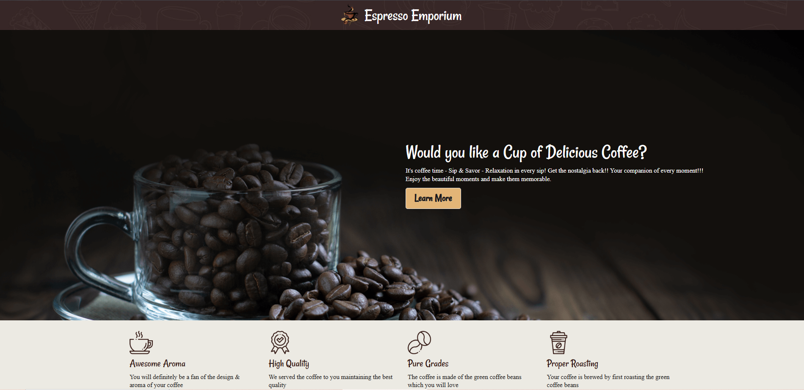

<h1 align="center">☕ Espresso Emporium</h1>

  A modern coffee shop management platform — explore, add, update, and manage coffees with a clean interface.

  
  
  
  
  
  
  
  
  

---

## 🧾 Overview

**Espresso Emporium** is a full-stack coffee shop management web application where users can browse coffees, add new coffees, update details, or delete them.
The **frontend** is built with **React, Tailwind CSS, and DaisyUI** for a clean, modern interface.
The **backend** is built with **Node.js, Express.js, and MongoDB**, deployed on **Render**, while the frontend is deployed on **Firebase**.

---

## ✨ Key Features

* ☕ **Coffee Management**

  * **Home Page:** Displays all coffee cards with details.
  * **Add Coffee:** Navigate to the add-coffee page to add new coffee. On success, a SweetAlert2 modal confirms the action.
  * **Update Coffee:** Edit coffee details using the **pen icon**.
  * **Delete Coffee:** Clicking the **delete button** shows a SweetAlert2 confirmation modal. Once confirmed, the coffee is removed.

* 🔍 **Coffee Details View**

  * Click on the **eye button** on a coffee card to view full details.

* 🎉 **Interactive Alerts**

  * SweetAlert2 modals for success, error, or confirmation messages (Add, Update, Delete).

* 📱 **Responsive Design**

  * Works seamlessly on mobile, tablet, and desktop.

---

## 📸 Preview

---

## 🔧 Tech Stack

| Technology           | Purpose                           |
| -------------------- | --------------------------------- |
| **HTML5**            | Semantic structure                |
| **Tailwind CSS**     | Utility-first responsive design   |
| **DaisyUI**          | Pre-styled Tailwind components    |
| **React**            | Component-based frontend          |
| **React Router**     | Navigation & route management     |
| **SweetAlert2**      | Success/Error/Confirmation modals |
| **React Icons**      | Icon library                      |
| **Node.js**          | Backend runtime                   |
| **Express.js**       | REST API development              |
| **MongoDB**          | Database for coffee data          |
| **Render**           | Backend deployment                |
| **Firebase Hosting** | Frontend deployment               |

---

## 🚦 How It Works

1. **Home Page:** Displays all coffees as cards with view, edit, and delete options.
2. **Add Coffee:** Use the form to add new coffee. SweetAlert2 confirms success or failure.
3. **Coffee Details:** Click the **eye icon** to view detailed coffee information.
4. **Update Coffee:** Edit coffee info by clicking the **pen icon**.
5. **Delete Coffee:** Click the delete button to confirm and remove a coffee item.

---

## 🚀 Deployment

* **Frontend:** Deployed on [Firebase Hosting](https://firebase.google.com/products/hosting).
* **Backend:** Deployed on [Render](https://render.com/)
